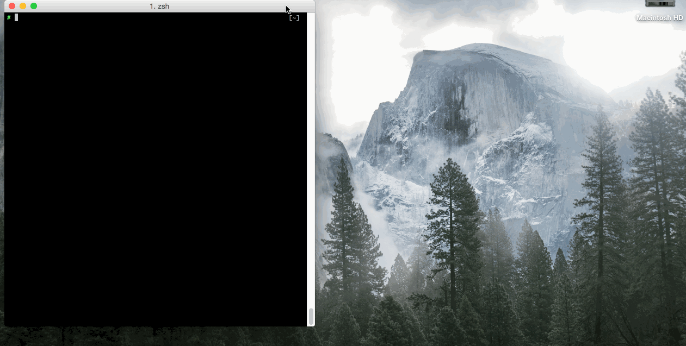

# kumatch/netgame

A game of network configurations.




## Requirement

* Go 1.7


## Installation

```
$ go get -u github.com/kumatch/netgame
```

## Run

```
$ netgame
```


## Commands

### exec mode

command | description
---- | ----
configure terminal | Enter global configuration mode.
exit | To close an active terminal in game.
show clock | Display clock.
show interfaces | Display statistics for all interfaces.


### global configure mode

command | description
---- | ----
interface <name> | Select a interface and enter interrface configuration mode.
hostname <name> | Set a hostname for this device.
end | Quit this mode and enter exec mode.


### interrface configuration mode

command | description
---- | ----
ip address <a.b.c.d> <w.x.y.z> | Set a IPv4 address to this interface (a.b.c.d = IPv4, w.x.y.z = subnet mask)
no shutdown | Shutdown this interface.
shutdown | Shutdown this interface.
end | Quit this mode and enter exec mode.

